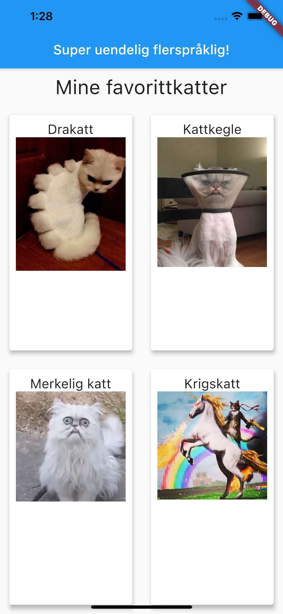
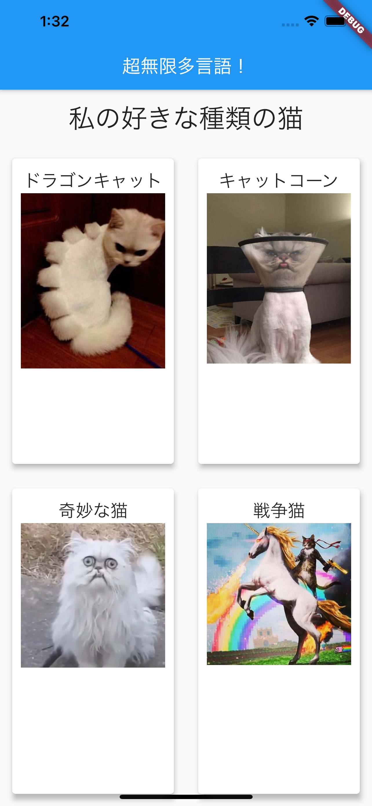
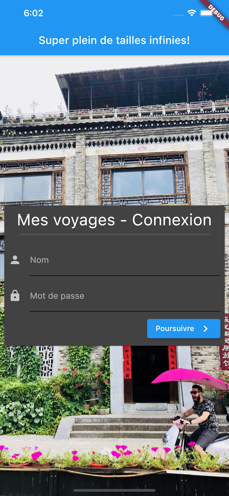
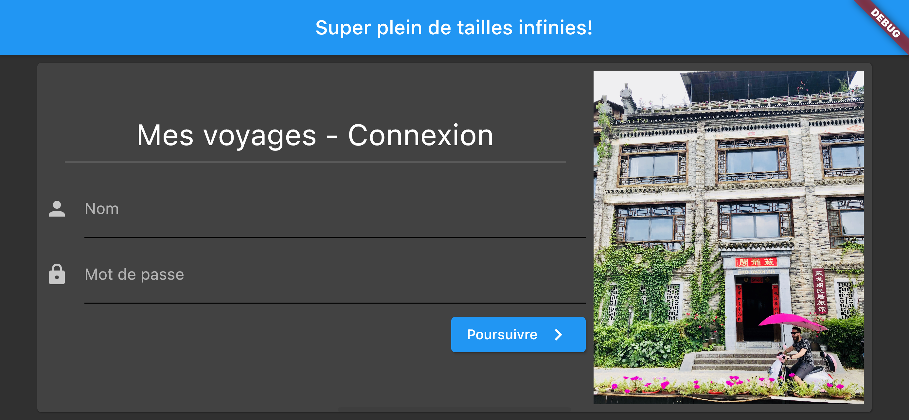

# Déploiement, portrait/paysage et multilingue

<Row>

<Column>

:::tip Avant la séance :

Assurez-vous d'avoir un Apple Id, si vous ne possédez pas de compte Apple, vous pouvez en créer un **[ici](https://appleid.apple.com/account)**.

Ce n'est pas nécessaire d'avoir un compte développeur, un compte Apple gratuit sera suffisant pour nos besoins dans ce cours.

Vous devrez étudier l'exemple de code suivant sur le [les changements d'orientations](https://github.com/departement-info-cem/5N6-mobile-2-Nouveau/tree/main/code/portrait_paysage). Cherchez les TODOs pour les explications. Dans IntelliJ **View** > **Tool Windows** > **TODO**.

Vous pouvez regarder la doc de Flutter en ligne sur l'internationalization [ici](https://flutter.dev/docs/development/accessibility-and-localization/internationalization)

Vous devrez étudier l'exemple de code suivant sur le **[multilingue](https://github.com/departement-info-cem/5N6-mobile-2-Nouveau/tree/main/code/multiling)**. Cherchez les TODOs pour les explications. Dans IntelliJ **View** > **Tool Windows** > **TODO**.

Vous pouvez regarder la doc de Flutter en ligne sur le déploiement Android [ici](https://flutter.dev/docs/deployment/android)

Vous devez regarder la video suivante sur le déploiement Android:

<Video url="https://youtu.be/jm_cKADnNqc" />

:::

</Column>

<Column>

:::info Séance 1 : Multilingue et OrientationBuilder

Nous regarderons comment utiliser l'OrientationBuilder pour contrôler les changements d'orientations

Vous compléterez les exercices pour comprendre les différents enjeux de la publication d'une application.

:::

:::info Séance 2 : Déploiement

Vous compléterez les exercices pour comprendre les différents enjeux de la publication d'une application.

:::

</Column>

</Row>

:::note Exercices

### Exercice multilingue_bizarre

Vous devez reproduire la mise en page de l'image suivante dans une appli Flutter appelée multilingue_bizarre. Rendre l'application disponible dans les langues suivantes:

- Francais
- Norvégien
- Japonais

<Row>

<Column>

</Column>

<Column>

</Column>

<Column>

</Column>

</Row>

### Exercice plein_de_tailles

Reproduire les mises en page suivantes dans une appli Flutter appelée plein_de_tailles. Il sera essentiel que la mise en page soit jolie peu importe la taille de l'écran, l'orientation et la résolution.

Vous aurez probablement besoin d'utiliser le [OrientationBuilder](https://flutter.dev/docs/cookbook/design/orientation).

Tester votre application avec les appreils suivants:

- Nexus One
- Pixel 4 XL
- Pixel C
- Nexus 7 (2012)
- iPhone
- iPad

<Row>

<Column size="3">

</Column>

<Column size="9">

</Column>

</Row>

:::
